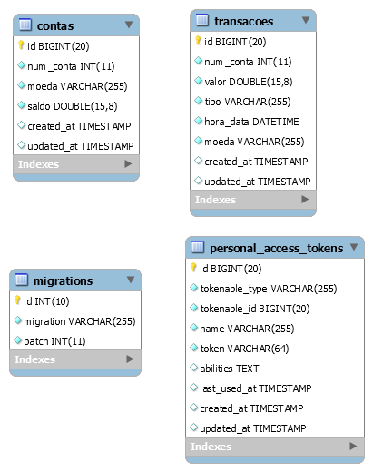

# **Projeto API para controle de um banco**
## *Vinícius Gomes Santa Anna vgsanna92@gmail.com*

--------------

### Resumo
O objetivo deste documento é apresentar o projeto de criação de uma api para controle de um banco.
Este projeto foi criado em php com a utilização do framework laravel e banco de dados MySql.

### 1. Configurações
- Após baixar o projeto configurar a conexão com o banco de dados.

Para isso no arquivo .env na pasta raiz do projeto modificar as seguintes linhas:

DB_CONNECTION=mysql

DB_HOST=127.0.0.1 

DB_PORT=3306

DB_DATABASE=api_banco

DB_USERNAME=root

DB_PASSWORD=

onde:

DB_HOST - Endereço do banco de dados.

DB_PORT - Porta do banco de dados.

DB_DATABASE=api_banco - Nome do Banco de dados.

DB_USERNAME - Usuário do banco de dados.

DB_PASSWORD - Senha do banco de dados.

- Instalar o composer

Para instalar o composer Executar no Prompt de Comando na pasta do projeto o seguinte comando:

composer install

### 1. Criando o Banco de Dados
Para a criação do banco de dados utilizando o laravel, seguir os seguintes passos:

- Inicialmente deve-se criar o banco de dados com o mesmo nome passado na propriedade DB_DATABASE utilizada no arquivo .env, nesse caso o nome será: api_banco.
- Após a criação do banco de dados, executar o comando no Prompt de comando na pasta onde está salvo o projeto:
- php artisan migrate

Esse comando cria todas as tabelas do banco de dados.

Segue o modelo ER do bando de dados:

### 2. Executando o Projeto
Após criação do Banco de Dados, para executar o projeto com o laravel deve-se executar o comando no Prompt de comando na pasta onde está salvo o projeto:
- php artisan serve

Após execução do comando a api está pronta para ser acessada em seu navegador, o enderço é mostrado no prompt de comando.

#### Endpoints

- Depósito: O primeiro endpoint é o depósito, que pode ser acessado na seguinte url:
http://localhost:8000/api/deposito/{num_conta}/{moeda}/{valor}

Após acessar esse endereço passando o número da conta a moeda e o valor, será retornado um json com os dados do depósito realizado.

- Saldo: O segundo endpoint é o saldo, que pode ser acessado na seguinte url:
O saldo pode ser mostrado de duas maneiras:

http://localhost:8000/api/saldo/{num_conta}: mostra o saldo em todas as moedas que a conta possui.

http://localhost:8000/api/saldo/{num_conta}/{moeda}: mostra o saldo na moeda solicitada, realizando a conversão de acordo com a taxa PTAX de conversão, caso a conta possua saldo em outras moedas.

Ambos os casos retonan um json com as informações do saldo da conta.

- Saque: O terceiro endpoint é o saque, que pode ser acessado na seguinte url:

http://localhost:8000/api/saque/{num_conta}/{moeda}/{valor}

O sistema realiza a verificação do saldo da conta em todas as moedas, caso você possua o saldo na moeda que solicitou o saque, ele realiza o saque seguindo os passos abaixo:
- verifica se possui saldo na moeda solicitada, caso afirmativo realiza o saque.
- caso não possua o saldo na moeda solicitada, ele realiza o saque com o saldo da conta em outras moedas, realizando a conversão de acordo com a taxa PTAX de conversão.

Após a realização do saque é retornado um json com as informações do saque e o novo saldo na conta.

- Extrato: O último endpoint é o extrato, que pode ser acessado na seguinte url:

http://localhost:8000/api/extrato/{num_conta}/{data_inicial}/{data_final}

Deve-se passar o número da conta a data inicial e final no formato YYYY-mm-dd, onde:

YYYY - Ano

mm - mes

dd - dia

Esse endpoint retorna um json com todas as transações realizadas no período solicitado.

- Moedas: as moedas e taxas de conversão utilizadas nesse projeto são disponibilizadas pela api do banco central, que pode ser acessada no seguinte link:
https://dadosabertos.bcb.gov.br/dataset/taxas-de-cambio-todos-os-boletins-diarios/resource/9d07b9dc-c2bc-47ca-af92-10b18bcd0d69

O sistema retorna as moedas que podem ser utilizadas no seguinte endpoint:
http://localhost:8000/api/moedas

#### Testes
Para execução dos testes utilizando o PHPunit deve digitar o seguinte comando no Prompt de Comando na raiz do projeto:

vendor/bin/phpunit --coverage-html tests/coverage

Com isso os testes (que podem ser visualizado na pasta tests) serão executados e um relatório de testes é salvo na pasta tests\coverage.